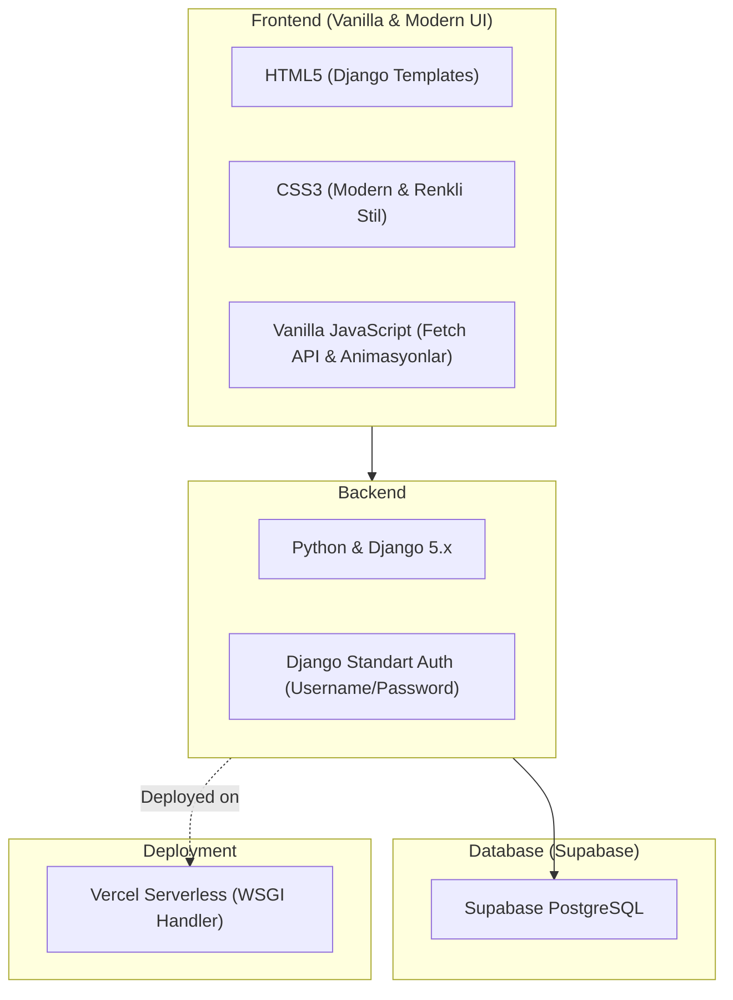
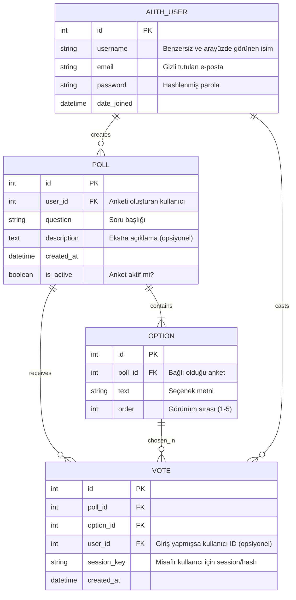

# 🎯 Proje: "Kararsızım" — Kapsamlı Proje Dokümantasyonu & Mimari Planı

---

## 1. Proje Genel Bakışı & Amacı
**Kararsızım**, günlük hayatta iki ya da daha fazla seçenek arasında kararsız kalan insanların ("Bugün sinemaya mı gitsem, restorana mı?", "Hangi telefonu alsam?", "Hangi filmi izlesem?") hızlıca anket açıp topluluğun fikrini alabildiği, genç, dinamik ve renkli bir sosyal oylama platformudur.

- **Ana Felsefe:** Hızlı, eğlenceli, sade ve zahmetsiz etkileşim.
- **Odak:** Karmaşık sosyal medya özellikleri (takip etme, mesajlaşma vb.) yerine doğrudan soru-cevap ve oylama odaklı bir prototip (MVP).

---

## 2. Kullanıcı Rolleri & Yetkilendirme

| Özellik | Ziyaretçi (Giriş Yapmamış) | Kayıtlı Kullanıcı |
| :--- | :---: | :---: |
| **Anketleri Görüntüleme** |  Evet |  Evet |
| **Anketleri Oylama** |  Evet (Anonim/Session tabanlı) |  Evet |
| **Sonuçları Canlı Görme** |  Evet |  Evet |
| **Yeni Anket Oluşturma** |  Hayır (Kayıt olmaya yönlendirilir) |  Evet |
| **Kendi Anketlerini Yönetme** |  Hayır |  Evet |

### Kayıt ve Gizlilik Kuralları:
- **Kayıt Alanları:** `Kullanıcı Adı (username)`, `E-posta (email)`, `Parola (password)`.
- **Gizlilik:** Kullanıcının e-posta adresi hiçbir arayüzde veya ankette **asla gösterilmez**.
- **Görünürlük:** Anket kartlarında ve detaylarında sadece kullanıcının seçtiği `@kullanici_adi` görünür.
- **Takip Mekanizması Yok:** Takipçi, takip edilen, arkadaş ekleme gibi karmaşık sistemler MVP kapsamında yer almaz.

---

## 3.  Temel Fonksiyonel Özellikler

### 3.1. Anket Oluşturma (Sadece Giriş Yapmış Kullanıcılar)
- **Başlık/Soru:** Kullanıcının kararsız kaldığı soru (Maksimum 250 karakter).
- **Açıklama (Opsiyonel):** Kararsızlık hakkında ek detay veya bağlam.
- **Seçenekler:** **En az 2, en fazla 5** seçenek eklenebilir.
- **Kategori/Etiket (Opsiyonel):** *Yemek, Eğlence, Teknoloji, Moda, Günlük Yaşam vb.*
- **Dinamik Seçenek Alanı:** JavaScript ile "Seçenek Ekle (+)" butonu (5 seçeneğe ulaşınca buton pasifleşir, en az 2 seçenek kalana kadar silme butonu aktiftir).

### 3.2. Oylama Sistemi & Mükerrer Oy Engelleme
- Ziyaretçiler ve kayıtlı kullanıcılar tek tıkla oy verebilir.
- **Mükerrer Oy Engelleme Mekanizması:**
  - *Kayıtlı Kullanıcılar için:* `User` + `Poll` tabanlı veritabanı kontrolü.
  - *Misafir Kullanıcılar için:* `Session Key` veya `Cookie / IP Hash` kontrolü ile aynı tarayıcıdan tek oy sınırı.
- **Anlık Geri Bildirim:** Oy verildiğinde sayfa yenilenmeden (Fetch / AJAX) oy yüzdeleri ve toplam oy sayıları animasyonlu bir şekilde güncellenir.

### 3.3. Ana Sayfa & Akış (Feed)
- **Filtreler:**
  - 🔥 **Popülerler:** En çok oy alan kararsızlıklar.
  - 🆕 **En Yeniler:** Son eklenen anketler.
- **Arama Kutusu:** Başlığa göre arama yapabilme.

---

## 4. 💻 Teknoloji Yığını (Tech Stack)



- **Backend:** Python 3.11+, Django 5.x
- **Veritabanı:** Supabase (Barındırılan PostgreSQL)
- **Frontend:** Django Template Engine, Vanilla HTML5, Modern CSS3 (Flexbox/Grid), Vanilla JavaScript
- **Deployment Platformu:** Vercel (Serverless Functions / `vercel.json` WSGI desteği)
- **Kütüphaneler & Paketler:**
  - `django`
  - `psycopg2-binary` veya `psycopg[binary]` (PostgreSQL sürücüsü)
  - `dj-database-url` (Supabase Connection String ayrıştırmak için)
  - `python-dotenv` (Çevre değişkenleri için)
  - `whitenoise` (Statik dosyaları yönetmek için)

---

## 5. 🗄️ Veritabanı Mimarisi (Supabase / PostgreSQL)



---

## 6. 🎨 Arayüz (UI/UX) & Tasarım Konsepti

Genç nesle hitap eden, enerjik, modern ve dikkat çekici bir görsel stil benimsenecektir:

### 🌈 Renk Paleti (Canlı & Enerjik)
- **Arka Plan:** Çok açık soft krem / lavanta tonu (`#F8F9FE` veya `#F5F3FF`)
- **Ana Vurgu Rengi (Primary):** Canlı Elektrik Moru (`#7C3AED`) / İndigo (`#6366F1`)
- **İkincil Canlı Renkler (Accent):**
  - Neon Mercan / Pembe: `#FF5E7E`
  - Canlı Turkuaz / Nane: `#06D6A0`
  - Güneş Sarısı: `#FFD166`
  - Gök Mavisi: `#3B82F6`
- **Kart Yapısı (Card Design):** Yumuşak gölgeli veya modern neo-brutalist hafif kalın kenarlıklı (`border: 2px solid #1E1B4B; box-shadow: 4px 4px 0px #1E1B4B;`) kartlar.
- **Butonlar & İpuçları:** Tıklama hissi yüksek, mikro ölçeklenme (`transform: scale(1.02);`) efektli butonlar.
- **Sonuç Grafikleri:** Seçeneklerin içinde renkli dolgu barları (% oranında dolan yumuşak gradientli çizgiler).

---

## 7. 📁 Önerilen Proje Dizin Yapısı

```text
kararsizim/
│
├── core/                       # Django proje ayarları
│   ├── __init__.py
│   ├── settings.py             # Supabase & Vercel yapılandırmaları
│   ├── urls.py
│   └── wsgi.py                 # Vercel entrypoint
│
├── polls/                      # Anket Uygulaması
│   ├── migrations/
│   ├── __init__.py
│   ├── admin.py
│   ├── apps.py
│   ├── models.py               # Poll, Option, Vote modelleri
│   ├── views.py                # Liste, Oluşturma, Oy Verme (AJAX)
│   ├── forms.py                # Anket & Seçenek Doğrulama Formları
│   └── urls.py
│
├── accounts/                   # Kullanıcı Yönetimi
│   ├── __init__.py
│   ├── views.py                # Kayıt, Giriş, Çıkış
│   ├── forms.py                # Kayıt & Giriş Formları
│   └── urls.py
│
├── static/                     # CSS, JS ve Görsel Dosyaları
│   ├── css/
│   │   └── style.css           # Genç ve renkli modern stiller
│   ├── js/
│   │   ├── poll_create.js      # Dinamik 2-5 seçenek ekleme/çıkarma
│   │   └── vote.js             # Sayfa yenilenmeden AJAX oy verme
│   └── images/
│
├── templates/                  # HTML Şablonları
│   ├── base.html               # Ortak Header, Navigasyon ve Footer
│   ├── polls/
│   │   ├── poll_list.html      # Ana sayfa (Anket akışı & filtreler)
│   │   ├── poll_detail.html    # Tekil anket görünümü & oylama
│   │   └── poll_create.html    # Yeni anket oluşturma sayfası
│   └── accounts/
│       ├── login.html          # Giriş sayfası
│       └── register.html       # Kayıt ol sayfası
│
├── vercel.json                 # Vercel dağıtım yapılandırması
├── requirements.txt            # Python bağımlılıkları
├── .env.example                # Ortam değişkenleri şablonu
└── manage.py
```

---

## 8. 🚀 Adım Adım Uygulama Yol Haritası (MVP)

### 🔹 Aşama 1: Temel Kurulum ve Veritabanı
1. Django projesinin (`kararsizim`) ve uygulamaların (`polls`, `accounts`) oluşturulması.
2. Supabase üzerinde ücretsiz bir PostgreSQL projesi açılıp connection URI'nin `.env` dosyasına eklenmesi.
3. `settings.py` içinde `dj-database-url` ile Supabase bağlantısının doğrulanması.

### 🔹 Aşama 2: Kullanıcı Sistemi & Gizlilik
1. Standart `UserCreationForm` ile e-posta, kullanıcı adı ve parola alanlarını içeren kayıt akışı.
2. Giriş (Login) ve Çıkış (Logout) görünümleri.
3. Şablonlarda hiçbir yerde e-posta değişkeninin basılmaması kuralının uygulanması.

### 🔹 Aşama 3: Anket ve Seçenek Modelleri
1. `Poll`, `Option` ve `Vote` modellerinin oluşturulup migrate edilmesi.
2. `clean()` metodunda seçenek sayısının **minimum 2, maksimum 5** olduğunu garanti eden validasyon.

### 🔹 Aşama 4: Renkli Frontend & AJAX Etkileşimi
1. `base.html` ve renkli CSS tasarımının kodlanması.
2. Anket oluşturma sayfasında JavaScript ile dinamik seçenek ekleme (2'den az silinemez, 5'ten fazla eklenemez).
3. Anket kartlarında tek tıkla oy verme ve fetch API ile anlık yüzde hesaplayıp barı doldurma.

### 🔹 Aşama 5: Vercel Dağıtımı (Deployment)
1. `vercel.json` dosyasının WSGI ayarlarıyla yapılandırılması.
2. Supabase veritabanı havuzlama (Connection Pooling - port 6543) ayarlarının yapılması.
3. Statik dosyaların Vercel ve WhiteNoise ile sorunsuz sunulması.

---

## 9. 🛡️ Önemli Güvenlik ve Performans İpuçları

1. **Supabase Connection Pooling (Önemli):** Vercel serverless ortamında Django her istekte yeni bağlantı açabileceğinden, Supabase Transaction Pooler (Port 6543) connection string'i kullanılmalıdır.
2. **SECRET_KEY & DEBUG:** Canlıya (Vercel) çıkarken `DEBUG = False` ve `SECRET_KEY` çevre değişkenlerinden (Environment Variables) çekilmelidir.
3. **Mükerrer Oy Koruması:** Misafir kullanıcıların tarayıcı oturumları (`request.session.session_key`) baz alınarak aynı ankete ikinci kez oy verilmesi engellenmelidir.

---

Bu dokümantasyon, projenin baştan sona hızlı, hatasız ve amaca uygun şekilde kodlanması için eksiksiz bir rehber niteliğindedir.
